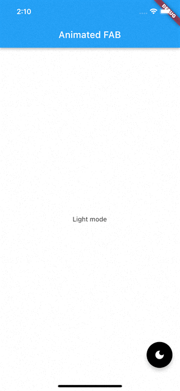

# Flutter Animated Floating Action Button

This article will help you build a `FloatingActionButton` that changes its properties using animations.

## Getting Started

To run the project open the iPhone simulator and run `flutter run`.

This article assumes basic knowledge of [Flutter](https://flutter.dev/) and [Dart](https://dart.dev/).

You can find the complete project [here](https://github.com/stassop/flutter_animated_fab).
